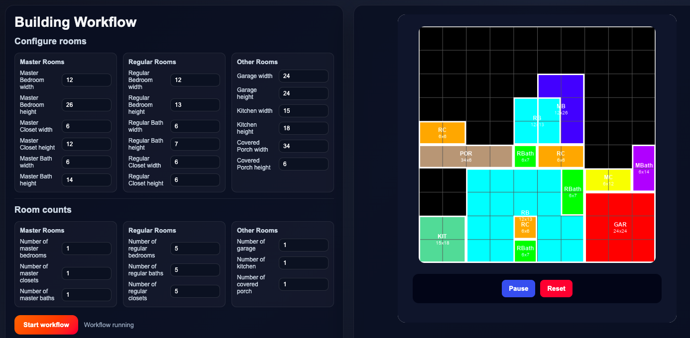

Tetris-inspired interactive building design transforms floor planning into a zero-waste, modular grid. Each room acts as a distinct block tailored to specific living functions—such as kitchens, master suites, and garages—with defined heights, widths, and placement requirements.

* **Functional Integration:** Connects complementary rooms based on usage—such as attaching master baths directly to bedrooms or placing kitchens adjacent to garage entryways—ensuring efficient circulation and practical room utility.
* **Zero Wasted Space:** Interlocking modular shapes snap together across a fixed floor grid, completely eliminating unused gaps, redundant hallways, and dead square footage.

This dynamic approach allows users to rapidly prototype fully optimized, highly functional architectural layouts in real time.

**How to run**

python app.py

python building_design.py
